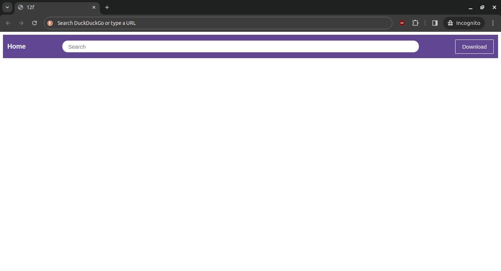
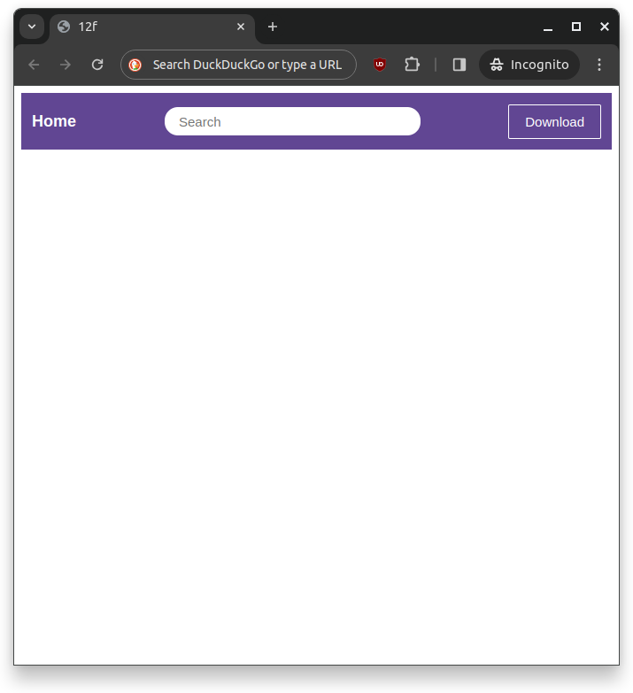

Exercise from [SimpleWebDev problem 12f](https://www.youtube.com/watch?v=G3e-cpL7ofc&list=PLEPye7A7EcQZrT3VSBb7jtxnxIfY3yyG6&index=1&t=15316s).

# Expectation

# Reality
## Fullscreen

## Halfscreen

