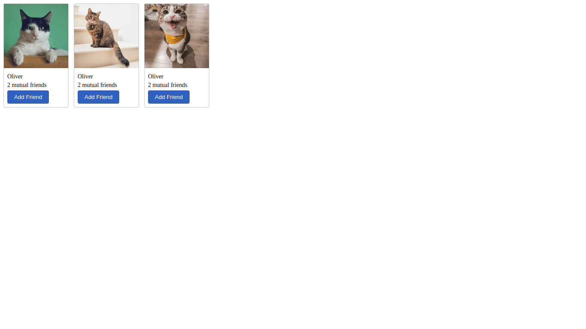
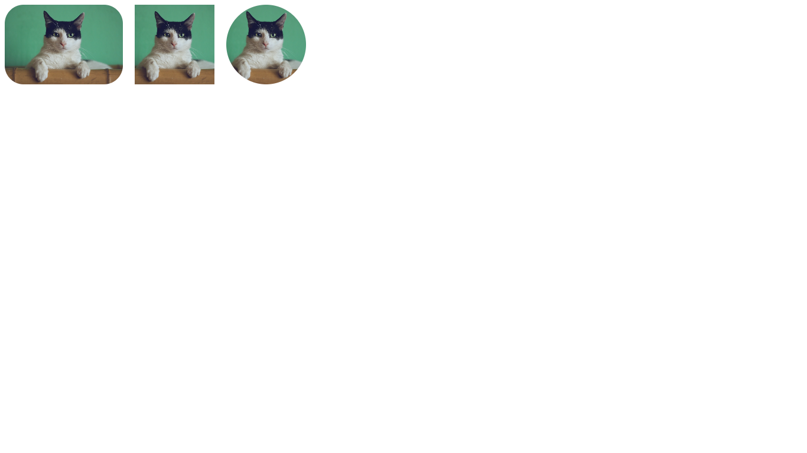
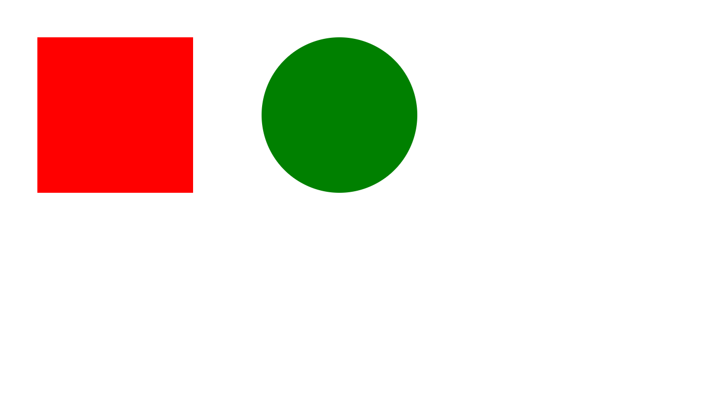
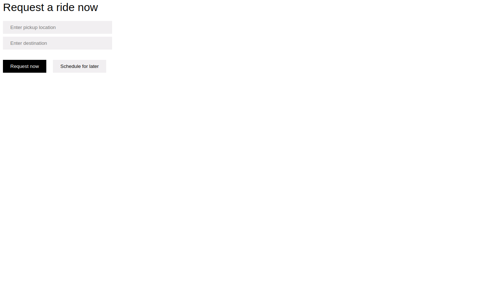

The format for each project starts with:

1. Description
2. Expectation screenshot
3. My result screenshot

## Screenshots

### 9g Design

### Image Exercise

### Red Square Green Circle

### Uber Request A Ride Form Clone

### Verdana Font

