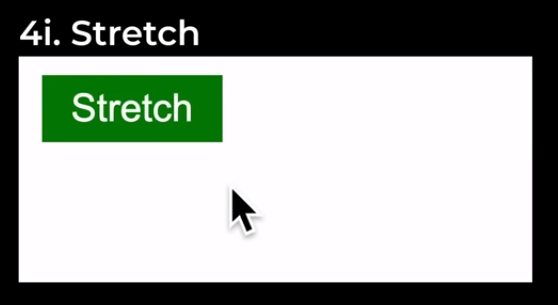
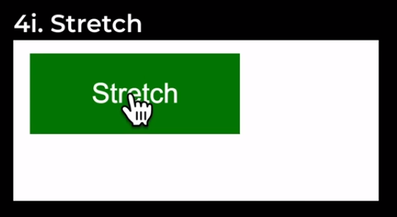

Stretch button based on [SimpleWebDev problem 4i.](https://www.youtube.com/watch?v=G3e-cpL7ofc&list=PLEPye7A7EcQZrT3VSBb7jtxnxIfY3yyG6&index=1&t=3788s)

# Expectation
## Before hover

## After hover

# Reality
## Before hover

## After hover

